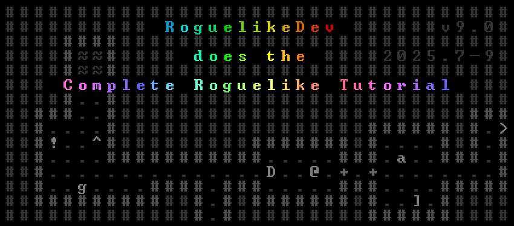

# roguelike_tutorial

2025 roguelike tutorial following the https://rogueliketutorials.com/ python tutorial in C++ with CMake.
A branch for each part is available to see the progression alongside the tutorial.

## Install

You need to install libtcod 2.1.1 and SDL3.

## Build

    mkdir build
    cd build
    cmake ..